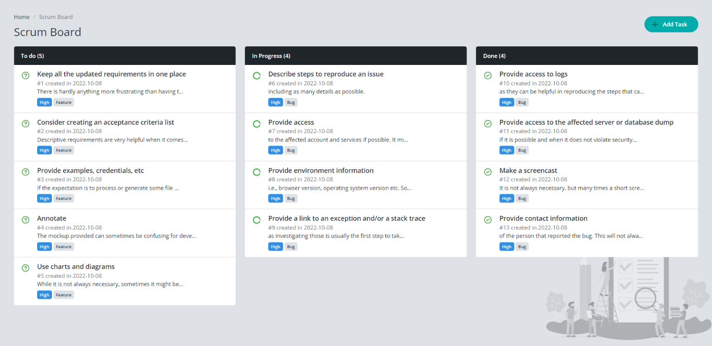
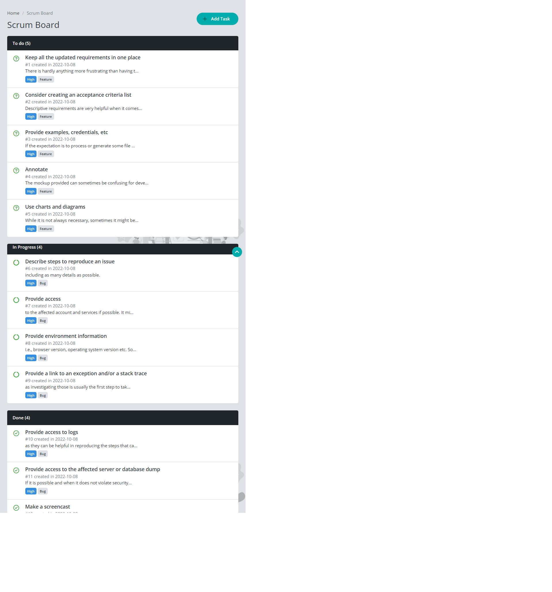
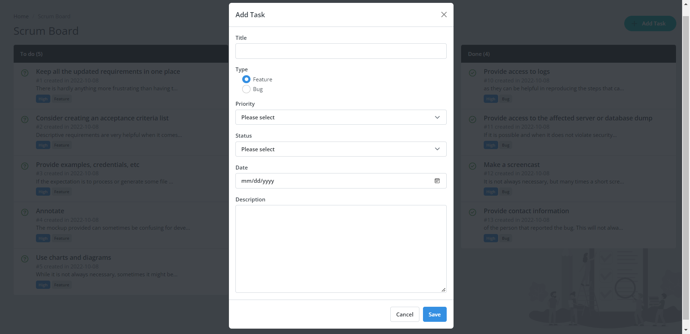

# YouCode Scrum Board Project

L'objectif est de développer une application web YouCode Scrum Board en bootstrap et de le rendre aussi proche que possible de la conception proposée.

## Bienvenue! 👋

Pour développer l'interface d'une application web avec responsive design, vous avez besoin d'une compréhension de base du HTML, CSS et d'une Framework Css pour faciliter le développement et rendre le code source très lisible avec les bons pratique de nomination des classes Css comme Bootstrap

## Où tout trouver?

Votre tâche consiste à construire low fidelity and high fidelity wireframes du projet à l'aide d'un outil de wireframing - web disign à partir des dessins et modèles contenus dans 📁 `/design`. Vous y trouverez une version mobile et une version de bureau de la conception sur laquelle travailler.

Les maquettes sont au format PNG statique. Cela signifie que vous devrez faire preuve de discernement pour les styles tels que 'font-size', 'padding' et 'margin'. Cela devrait vous aider à entraîner votre œil à percevoir les différences d'espacement et de taille.

Vous y trouverez le fichier html sur laquelle travailler `index.html` pour ajouter les classes css du Bootstrap 5, et si vous avez besoin d'ajouter quelques propriétés css utilisez le fichier `style.css` dans 📁 `/assets/css`.

## Construire votre projet

N'hésitez pas à utiliser le flux de travail qui vous convient le mieux. Vous trouverez ci-dessous une suggestion de procédure, mais n'estimez pas nécessaire de suivre ces étapes :

1. Initialisez votre projet en tant que dépôt public sur [GitHub](https://github.com/).
2. Configurez votre repository pour publier votre code dans un URL. I existe plusieurs méthode de procéder, (Deployment).
3. Créez un projet à l'aide d'un outil de wireframing - web design, et exporter le livrable en format PDF dans un 📁 nommé `/mockup` si vous n'avez pas utilisez Figma ou Adobe XD.
4. Examinez les modèles pour commencer à planifier la manière dont vous allez aborder le projet. Cette étape est cruciale pour vous aider à anticiper les classes CSS du Bootstrap réutilisables.
5. Avant d'ajouter des classes css et styles, le contenu du HTML est déjà structuré. Le fait d'écrire d'abord des classes en Bootstrap peut vous aider à vous concentrer sur l'apprentissage de plusieurs ensembles des composants d'un contenu bien structurés.
6. Le projet manque d'un composant nommé modal ou bien popup. (Voir la partie Modal preview)
7. Ce modal contient tout simplement un formulaire d'ajouter une nouvelle tâche (**`Title`**, Type (**`Feature`** ou bien **`Bug`**), **`Priority`** (**`Low`**, **`Medium`**, **`High`**, **`Critical`**), Status(**`To Do`**, **`In Progress`**, **`Done`**), **`Date`** et **`Description`**, lorsqu'un utilisateur clique sur le Boutton `Add Task`.

## Layout

Les designs ont été créés dans les largeurs (widths) suivantes:
- Mobile: **375px**
- Desktop: **1440px**
Voir les maquettes en format PNG dans 📁 `/design`.

## Preview

### Desktop preview

---
### Mobile preview

---
### Modal preview

---

Best of luck! 🚀
